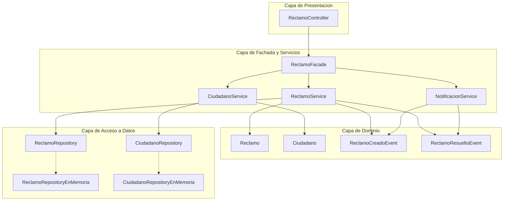
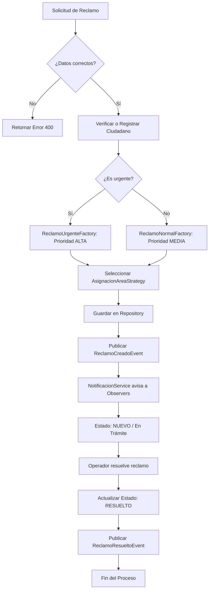
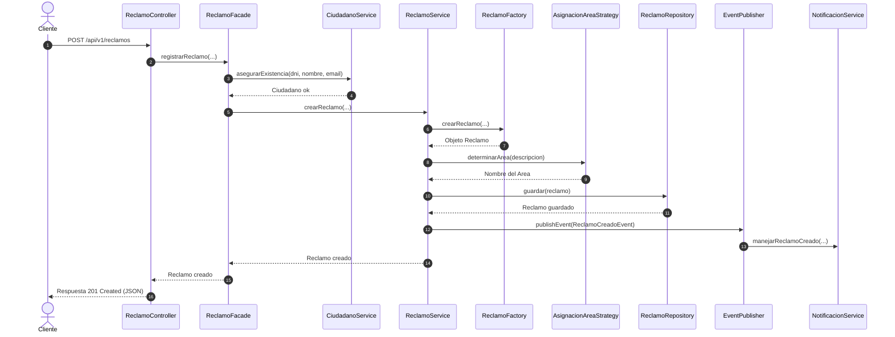
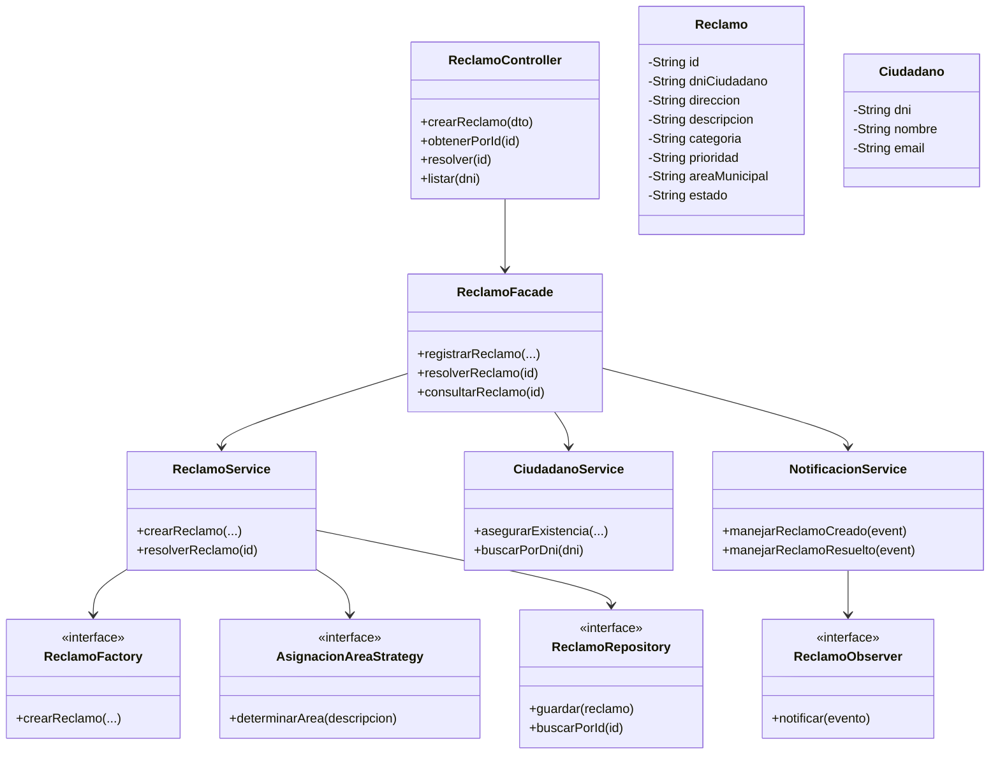

# UNIVERSIDAD ARGENTINA DE LA EMPRESA
## Facultad de Ingeniería y Tecnologías de la Información
### Desarrollo de Aplicaciones II

Docente: Mg. Christian Parkinson  
Trabajo Práctico: Primera Parte - Arquitectura de Aplicaciones e Integración  
Fecha de Entrega: 12 de Octubre de 2026  

---

# 1. Introducción y Dominio Elegido

Para este trabajo práctico desarrolle un sistema enfocado en la gestión y resolución de reclamos e incidentes urbanos municipales. El objetivo principal de la aplicación es recibir reclamos reportados por los ciudadanos, analizar su prioridad, asignar automáticamente la dirección municipal correspondiente y notificar a los sistemas de auditoría y atención al cliente.

La solución fue desarrollada utilizando el framework Spring Boot en Java 21 y gestionada a través de Maven. Se aplican los cinco patrones de diseño solicitados en la consigna (Factory, Repository, Strategy, Observer y Facade), organizando la lógica de negocio en componentes desacoplados que se comunican mediante eventos de dominio.

---

# 2. Arquitectura en Capas

La aplicación está organizada en una arquitectura en capas tradicional para mantener una clara separación de responsabilidades:

1. Capa de Presentacion (Controladores REST): Recibe las peticiones HTTP desde el cliente, valida los DTOs de entrada y devuelve las respuestas formateadas en JSON con sus respectivos códigos de estado HTTP.

2. Capa de Fachada y Servicios de Negocio:
- ReclamoFacade: Funciona como punto de entrada único para la capa de presentación, coordinando los distintos servicios.
- ReclamoService: Gestiona la lógica del ciclo de vida del reclamo.
- CiudadanoService: Administra los datos del ciudadano y su registro.
- NotificacionService: Escucha los eventos de dominio y notifica a los observadores.

3. Capa de Dominio: Contiene las clases de negocio (Reclamo, Ciudadano) y los eventos de dominio (ReclamoCreadoEvent, ReclamoResueltoEvent).

4. Capa de Acceso a Datos (DAO / Repositorios): Abstrae la persistencia mediante interfaces de repositorio y sus implementaciones en memoria.

5. Capa de Utilidad: Contiene clases auxiliares como ValidadorReclamo para validar formato de DNI, email y textos.

Diagrama Estructural de Capas:



---

# 3. Servicios Orientados a Componentes

La lógica del sistema fue estructurada en tres servicios independientes:

- CiudadanoService: Se encarga de validar los datos personales del ciudadano, verificar si ya existe en la base de datos y registrarlo en caso contrario.

- ReclamoService: Contiene la lógica para la creación de reclamos. Utiliza una fábrica para instanciar reclamos normales o urgentes, selecciona la estrategia para definir el área municipal competente, persiste la entidad y emite un evento de dominio.

- NotificacionService: Actúa como el centro de notificaciones. Escucha los eventos generados en el sistema y despacha las novedades hacia los observadores registrados.

---

# 4. Integración mediante Interfaces y Eventos de Dominio

En lugar de llamar directamente al servicio de notificaciones dentro de la lógica del reclamo, el sistema utiliza eventos de dominio (ReclamoCreadoEvent y ReclamoResueltoEvent) publicados mediante ApplicationEventPublisher de Spring.

El servicio NotificacionService está anotado con @EventListener, lo que le permite reaccionar automáticamente cada vez que se emite un evento. Esto garantiza un bajo acoplamiento entre el módulo que procesa la lógica principal y los módulos receptores de alertas o auditoría.

---

# 5. Patrones de Diseño Aplicados

## 5.1. Patrón Factory Method
Permite instanciar objetos Reclamo sin exponer la lógica de creación al cliente.
- ReclamoFactory (Interfaz): Define el método crearReclamo.
- ReclamoNormalFactory: Asigna un prefijo "REC-" al identificador y una prioridad "MEDIA".
- ReclamoUrgenteFactory: Asigna un prefijo "REC-URG-" y una prioridad "ALTA" cuando la descripción contiene palabras clave de emergencia como peligro o escuela.

Ejemplo de código:
```java
@Component("URGENTE_FACTORY")
public class ReclamoUrgenteFactory implements ReclamoFactory {
    @Override
    public Reclamo crearReclamo(String dni, String direccion, String descripcion, String categoria) {
        String reclamoId = "REC-URG-" + UUID.randomUUID().toString().substring(0, 8).toUpperCase();
        Reclamo reclamo = new Reclamo(reclamoId, dni, direccion, descripcion, categoria);
        reclamo.setPrioridad("ALTA");
        return reclamo;
    }
}
```

## 5.2. Patrón Repository
Proporciona una abstracción de la capa de datos.
- ReclamoRepository / CiudadanoRepository: Interfaces con métodos como guardar, buscarPorId y obtenerTodos.
- ReclamoRepositoryEnMemoria / CiudadanoRepositoryEnMemoria: Implementaciones que utilizan Mapas concurrentes para almacenar los datos durante la ejecución.

Ejemplo de código:
```java
public interface ReclamoRepository {
    Reclamo guardar(Reclamo reclamo);
    Optional<Reclamo> buscarPorId(String id);
    List<Reclamo> obtenerTodos();
}
```

## 5.3. Patrón Strategy
Permite seleccionar dinámicamente el algoritmo para determinar el área municipal responsable según la categoría del reclamo.
- AsignacionAreaStrategy (Interfaz): Define el método determinarArea.
- AsignacionAlumbradoStrategy: Deriva a la Dirección de Mantenimiento del Espacio Público y Luminarias.
- AsignacionTransitoStrategy: Deriva a la Dirección General de Seguridad Vial y Semaforización.

Ejemplo de código:
```java
@Component("TRANSITO")
public class AsignacionTransitoStrategy implements AsignacionAreaStrategy {
    @Override
    public String determinarArea(String descripcion) {
        return "Dirección General de Seguridad Vial y Semaforización";
    }
}
```

## 5.4. Patrón Observer
Notifica automáticamente a los suscriptores cuando cambia el estado de un reclamo.
- ReclamoObserver (Interfaz): Define el método notificar.
- NotificacionMesaEntradasObserver: Implementación concreta que registra la novedad en la mesa de entradas.

Ejemplo de código:
```java
@Component
public class NotificacionMesaEntradasObserver implements ReclamoObserver {
    @Override
    public void notificar(ReclamoEvento evento) {
        System.out.println("[MESA DE ENTRADAS] Evento: " + evento.getTipoEvento() + " - ID: " + evento.getReclamoId());
    }
}
```

## 5.5. Patrón Facade
Simplifica la interacción de la capa web coordinando los tres servicios internos.
- ReclamoFacade: Expone métodos sencillos como registrarReclamo y resolverReclamo, ocultando la complejidad de llamadas entre CiudadanoService, ReclamoService y NotificacionService.

Ejemplo de código:
```java
@Service
public class ReclamoFacade {
    private final ReclamoService reclamoService;
    private final CiudadanoService ciudadanoService;
    private final NotificacionService notificacionService;

    public Reclamo registrarReclamo(String dni, String direccion, String descripcion, String categoria, String nombre, String email) {
        ciudadanoService.asegurarExistencia(dni, nombre, email);
        return reclamoService.crearReclamo(dni, direccion, descripcion, categoria);
    }
}
```

---

# 6. Modelado del Proceso de Negocio

## 6.1. Diagrama del Proceso de Negocio (BPMN Simplificado)

El flujo del reclamo desde el reporte del ciudadano hasta su resolución final se representa en el siguiente esquema:



## 6.2. Diagrama de Secuencia UML

A continuación se muestra el intercambio de mensajes paso a paso entre los componentes del sistema durante el alta de un reclamo:



---

# 7. Diagrama de Clases UML Global



---

# 8. Guía de Pruebas y Comandos de Ejemplo

Para compilar el proyecto y ejecutar las pruebas unitarias:
```powershell
cd api-envios
.\mvnw.cmd test
```

Para iniciar el servidor Spring Boot:
```powershell
cd api-envios
.\mvnw.cmd spring-boot:run
```

Ejemplos de comandos para probar en PowerShell:

1. Registrar un reclamo urgente:
```powershell
$body = @{
    dniCiudadano = "40123456"
    direccion = "Av. San Juan y Lima"
    descripcion = "Semaforo caido con peligro inminente de accidente frente a escuela"
    categoria = "TRANSITO"
    nombreCiudadano = "Martin Gomez"
    emailCiudadano = "martin.gomez@gmail.com"
} | ConvertTo-Json

Invoke-RestMethod -Uri "http://localhost:8080/api/v1/reclamos" -Method Post -ContentType "application/json; charset=utf-8" -Body $body | ConvertTo-Json
```

2. Consultar ciudadanos registrados:
```powershell
Invoke-RestMethod -Uri "http://localhost:8080/api/v1/reclamos/ciudadanos" | ConvertTo-Json
```

3. Consultar historial de notificaciones:
```powershell
Invoke-RestMethod -Uri "http://localhost:8080/api/v1/reclamos/notificaciones" | ConvertTo-Json
```
