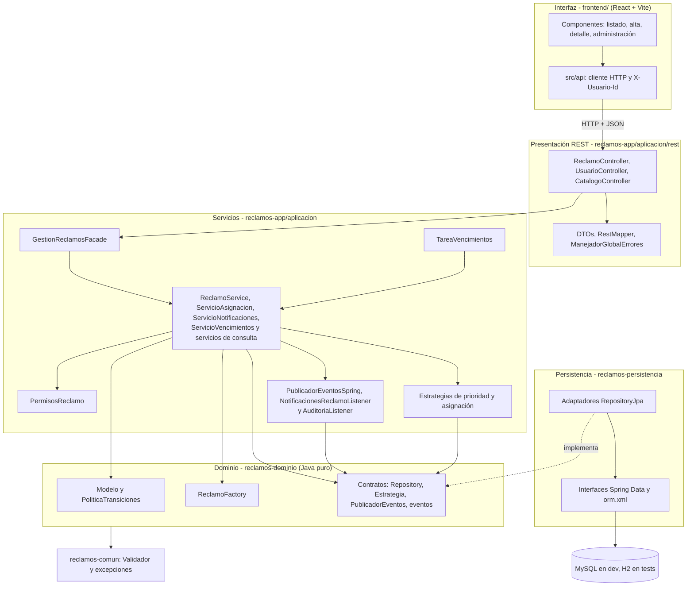
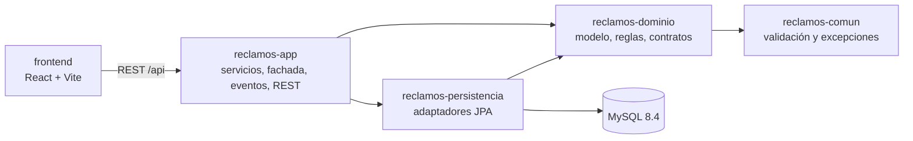

# Arquitectura

El sistema es una aplicación en capas: cada capa solo conoce a la que tiene debajo, y el dominio no
depende de ningún framework.

## Capas



El recorrido de una operación es siempre el mismo:

```text
React → Controller → Facade → Servicios → Dominio → Repository → JPA → MySQL
```

| Capa | Dónde está | Responsabilidad | No hace |
| --- | --- | --- | --- |
| Interfaz | `frontend/` | Mostrar reclamos y enviar acciones del usuario | No decide permisos: muestra las `accionesDisponibles` que calcula el backend |
| Presentación REST | `reclamos-app/.../aplicacion/rest` | Traducir HTTP y JSON a llamadas de la fachada; uniformar errores | No tiene lógica de negocio |
| Servicios | `reclamos-app/.../aplicacion` | Coordinar cada caso de uso dentro de una transacción | No conoce HTTP ni JPA |
| Dominio | `reclamos-dominio` | Reglas del negocio, creación del reclamo, contratos | No depende de Spring ni de JPA |
| Persistencia | `reclamos-persistencia` | Implementar los Repository con Spring Data JPA | No tiene reglas de negocio |
| Utilidades | `reclamos-comun` | Validación y excepciones compartidas | No depende de nada |

El detalle de las clases del dominio y de las tablas está en [modelo-dominio.md](modelo-dominio.md).

## Componentes

Cada módulo Maven es un componente con artefacto propio. Las dependencias van en un solo sentido.



## Servicios orientados a componentes

Cada servicio tiene una responsabilidad y se puede probar por separado.

| Servicio | Responsabilidad |
| --- | --- |
| `ReclamoService` | Casos de uso de escritura: crear, asignar, reasignar y cambiar de estado |
| `ServicioAsignacion` | Decidir qué área atiende un reclamo: automática con la estrategia activa, o manual |
| `ServicioNotificaciones` | Decidir a quién se avisa en cada evento y guardar los avisos |
| `ServicioVencimientos` | Marcar los reclamos que pasaron su fecha límite y publicar `ReclamoVencido` |
| `ConsultaReclamosService` | Listar según el rol, buscar por número, avisos y acciones disponibles |
| `ConsultaCatalogosService` | Usuarios, categorías, barrios y áreas |
| `PermisosReclamo` | Quién puede crear y quién puede ver cada reclamo |

Los servicios se integran entre sí de dos formas:

- **Por interfaces.** Dependen de los contratos del dominio (`ReclamoRepository`,
  `EstrategiaPrioridad`, `EstrategiaAsignacion`, `PublicadorEventos`) y Spring inyecta la
  implementación.
- **Por eventos de dominio.** `ReclamoService` y `ServicioVencimientos` publican `ReclamoCreado`,
  `ReclamoAsignado`, `EstadoReclamoCambiado`, `ReclamoResuelto` y `ReclamoVencido`. Dos listeners
  reaccionan sin que quien publica los conozca: `NotificacionesReclamoListener` genera los avisos
  y `AuditoriaListener` registra cada evento.

`TareaVencimientos` ejecuta `ServicioVencimientos` cada minuto. El intervalo se cambia con
`reclamos.vencimientos.intervalo-ms` y la tarea se apaga con `reclamos.vencimientos.habilitado: false`.

## Decisiones de diseño

| Decisión | Motivo |
| --- | --- |
| Mapeo JPA en `META-INF/orm.xml` en lugar de anotaciones | El dominio queda sin ninguna dependencia de JPA y se prueba con JUnit solo |
| Interfaces Repository en el dominio, adaptadores en persistencia | Los servicios no dependen de `JpaRepository`; en los tests se reemplazan por dobles en memoria |
| Transiciones en una tabla (`PoliticaTransiciones`) y no con el patrón State | Nueve transiciones se leen mejor en una tabla que repartidas en siete clases |
| Identidad con el encabezado `X-Usuario-Id` | El Hito 1 no pide autenticación; el rol sale del usuario guardado en la base |
| Los avisos se generan dentro de la transacción | Si el listener de avisos falla se revierte todo el caso de uso; no quedan reclamos sin aviso |
| La auditoría corre después del commit | Solo registra hechos confirmados; una operación revertida no deja rastro falso |
| El frontend llama a `/api` en su mismo origen y un proxy reenvía al backend | No hace falta configurar CORS en Spring; funciona igual con Vite y con nginx |
| `accionesDisponibles` en la respuesta del reclamo | La interfaz no repite las reglas de transición: muestra un botón por cada acción |
| `open-in-view: false` y DTOs en REST | No se serializan entidades JPA ni se abren consultas durante la respuesta HTTP |

## Preparado para el Hito 2

Ninguna de estas integraciones está implementada; el diseño deja el lugar donde entran.

| Integración | Dónde entra | Qué se agrega |
| --- | --- | --- |
| Clasificación con IA | `EstrategiaPrioridad` | Una clase `PrioridadPorIA` y un valor más en la configuración |
| Servicio SOAP de jurisdicción | `EstrategiaAsignacion` | Una clase `AsignacionPorJurisdiccionRemota` |
| Broker de mensajes | `PublicadorEventos` y los eventos de dominio | Un listener que reenvía los mismos eventos a RabbitMQ después del commit, como hace hoy `AuditoriaListener` |
| Geolocalización | `ReclamoService.crear` | Un cliente detrás de una interfaz y dos columnas en `Reclamo` |

## Límites conocidos del Hito 1

- **Avisos simulados.** Las notificaciones se guardan en la base con canal `INTERNO`; no se envían
  correos ni SMS.
- **Sin autenticación.** El usuario se identifica con `X-Usuario-Id`; cualquiera puede elegir
  cualquier usuario.
- **Listados sin paginar.** Los filtros se aplican en memoria sobre los reclamos visibles.
- **Datos maestros de solo lectura.** Áreas, categorías, barrios y usuarios salen de la semilla; no
  hay alta ni edición desde la interfaz.

## Decisiones abiertas para el Hito 2

| Tema | Qué hay que decidir |
| --- | --- |
| Geolocalización | Hoy el ciudadano elige el barrio de una lista y el reclamo no guarda coordenadas. Definir si la API externa solo normaliza la dirección y guarda latitud y longitud, o si además deduce el barrio |
| Servicio SOAP | Qué recibe la consulta de jurisdicción: barrio y categoría, o coordenadas. Depende de la decisión anterior |
| IA | La categoría la carga el ciudadano, así que la IA puede estimar la prioridad y sugerir la categoría, no reemplazarla |
| IA sincrónica o por cola | Llamar al modelo dentro del alta con tiempo límite y vuelta a `PrioridadPorCategoria`, o consumir `ReclamoCreado` desde la cola y actualizar la prioridad después |
| Identificador de evento | Los eventos no tienen id propio; los consumidores lo necesitan para no procesar dos veces un mensaje |
| Más de un proceso | El servicio SOAP y el de IA deben ser aplicaciones separadas de `reclamos-app` |
