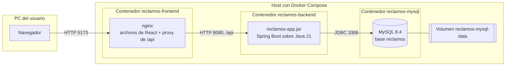

# Despliegue

El sistema se despliega en tres contenedores. El navegador solo habla con el contenedor del
frontend, que sirve la interfaz y reenvía las llamadas a `/api` al backend.

| Contenedor | Imagen | Puerto publicado | Qué contiene |
| --- | --- | --- | --- |
| `reclamos-frontend` | `nginx:1.27-alpine`, construida desde `frontend/Dockerfile` | 5173 | Interfaz React compilada y proxy de `/api` |
| `reclamos-backend` | `eclipse-temurin:21-jre`, construida desde `backend/Dockerfile` | 8080 | `reclamos-app.jar`, que incluye los cuatro módulos Maven |
| `reclamos-mysql` | `mysql:8.4` | 3306 | Base de datos, con los datos en un volumen |

## Configuración externalizada

| Variable | Dónde se usa | Para qué |
| --- | --- | --- |
| `DB_NAME`, `DB_USER`, `DB_PASSWORD`, `MYSQL_ROOT_PASSWORD`, `DB_PORT` | `.env`, leído por Compose | Credenciales y puerto de MySQL |
| `DB_URL` | Contenedor del backend | URL de conexión; apunta al servicio `mysql` de la red de Compose |
| `reclamos.prioridad.estrategia`, `reclamos.asignacion.estrategia` | `application.yml` | Estrategias activas |
| `reclamos.vencimientos.habilitado`, `reclamos.vencimientos.intervalo-ms` | `application.yml` | Control de vencimientos |
| `VITE_BACKEND_URL` | `frontend/.env`, solo en desarrollo | Adónde reenvía Vite las llamadas a `/api` |

## Dos formas de ejecutar

| Modo | MySQL | Backend | Frontend | Comando |
| --- | --- | --- | --- | --- |
| Desarrollo | Contenedor | En la máquina, con Maven | En la máquina, con Vite | `docker compose up -d mysql` y después backend y frontend a mano |
| Demo | Contenedor | Contenedor | Contenedor | `docker compose up --build` |

En desarrollo el proxy de `/api` lo hace Vite; en la demo lo hace nginx. Para el navegador es lo
mismo: siempre llama a `/api` en el origen de la interfaz.
