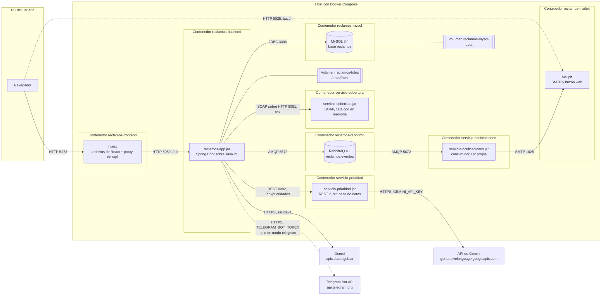
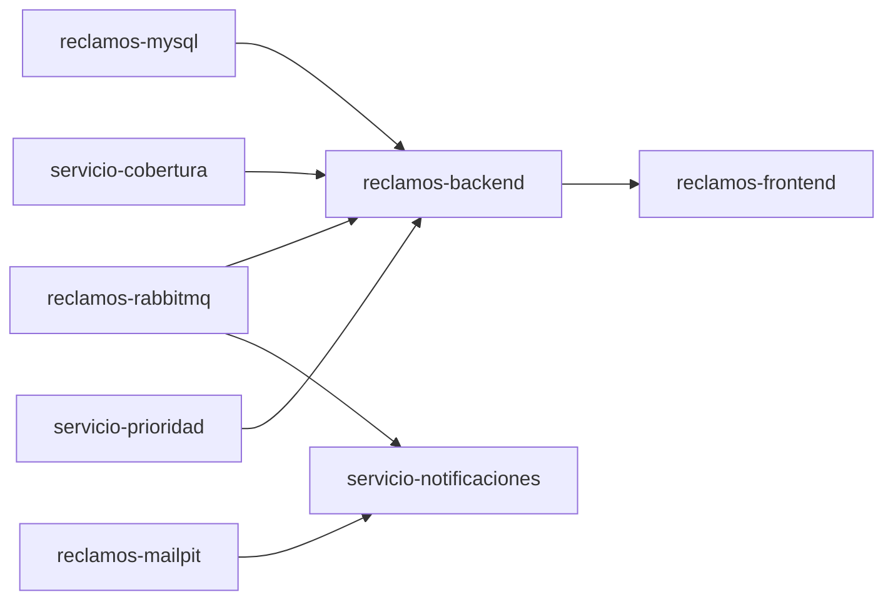

# Despliegue

El sistema se despliega en ocho contenedores. El navegador solo habla con el contenedor del
frontend, que sirve la interfaz y reenvía las llamadas a `/api` al backend. El backend consulta la
cobertura al servicio SOAP y la prioridad al servicio de IA por la red interna de Compose. Salen a
Internet el servicio de IA, a la API de Gemini, y el backend, a Georef para ubicar las direcciones y, si el
modo de verificación es `telegram`, a la Bot API de Telegram. Las fotos de los reclamos quedan en un volumen
del backend.

```mermaid
flowchart LR
  subgraph PC["PC del usuario"]
    NAV["Navegador"]
  end
  subgraph DOCKER["Host con Docker Compose"]
    subgraph CF["Contenedor reclamos-frontend"]
      NGINX["nginx<br/>archivos de React + proxy de /api"]
    end
    subgraph CB["Contenedor reclamos-backend"]
      APP["reclamos-app.jar<br/>Spring Boot sobre Java 21"]
    end
    subgraph CM["Contenedor reclamos-mysql"]
      DB[("MySQL 8.4<br/>base reclamos")]
    end
    subgraph CS["Contenedor servicio-cobertura"]
      SOAP["servicio-cobertura.jar<br/>SOAP, catálogo en memoria"]
    end
    subgraph CP["Contenedor servicio-prioridad"]
      IA["servicio-prioridad.jar<br/>REST 2, sin base de datos"]
    end
    subgraph CR["Contenedor reclamos-rabbitmq"]
      MQ[("RabbitMQ 4.1<br/>reclamos.eventos")]
    end
    subgraph CN["Contenedor servicio-notificaciones"]
      NOT["servicio-notificaciones.jar<br/>consumidor, H2 propia"]
    end
    subgraph CMP["Contenedor reclamos-mailpit"]
      MP["Mailpit<br/>SMTP y buzón web"]
    end
    VOL[["Volumen reclamos-mysql-data"]]
    VOLF[["Volumen reclamos-fotos<br/>/data/fotos"]]
  end
  GEM["API de Gemini<br/>generativelanguage.googleapis.com"]
  GEO["Georef<br/>apis.datos.gob.ar"]
  TG["Telegram Bot API<br/>api.telegram.org"]

  NAV -->|"HTTP 5173"| NGINX
  NGINX -->|"HTTP 8080, /api"| APP
  APP -->|"JDBC 3306"| DB
  APP -->|"SOAP sobre HTTP 8081, /ws"| SOAP
  APP -->|"REST 8082, /api/prioridades"| IA
  IA -->|"HTTPS, GEMINI_API_KEY"| GEM
  APP -->|"HTTPS, sin clave"| GEO
  APP -.->|"HTTPS, TELEGRAM_BOT_TOKEN<br/>solo en modo telegram"| TG
  APP --- VOLF
  APP -->|"AMQP 5672"| MQ
  MQ -->|"AMQP 5672"| NOT
  NOT -->|"SMTP 1025"| MP
  NAV -.->|"HTTP 8025, buzón"| MP
  DB --- VOL
```

| Contenedor | Imagen | Puerto publicado | Qué contiene |
| --- | --- | --- | --- |
| `reclamos-frontend` | `nginx:1.27-alpine`, construida desde `frontend/Dockerfile` | 5173 | Interfaz React compilada y proxy de `/api` |
| `reclamos-backend` | `eclipse-temurin:21-jre`, construida desde `backend/Dockerfile` | 8080 | `reclamos-app.jar`, que incluye los cuatro módulos Maven. Las fotos de los reclamos quedan en el volumen `reclamos-fotos` (`/data/fotos`) |
| `reclamos-mysql` | `mysql:8.4` | 3306 | Base de datos, con los datos en un volumen |
| `servicio-cobertura` | `eclipse-temurin:21-jre`, construida desde `servicios/servicio-cobertura/Dockerfile` | 8081 | Servicio SOAP de cobertura; el WSDL queda en `http://localhost:8081/ws/cobertura.wsdl` |
| `servicio-prioridad` | `eclipse-temurin:21-jre`, construida desde `servicios/servicio-prioridad/Dockerfile` | 8082 | Servicio de prioridad con IA (REST 2); Swagger UI en `http://localhost:8082/swagger-ui.html` |
| `reclamos-rabbitmq` | `rabbitmq:4.1-management` | 5672 y 15672 | Broker de mensajes, con sus datos en un volumen; consola web en `http://localhost:15672` |
| `servicio-notificaciones` | `eclipse-temurin:21-jre`, construida desde `servicios/servicio-notificaciones/Dockerfile` | Ninguno | Consumidor de la cola `notificaciones.email`; guarda los `eventId` procesados en el volumen `notificaciones-datos` |
| `reclamos-mailpit` | `axllent/mailpit` | 1025 y 8025 | SMTP de prueba; los correos se ven en `http://localhost:8025` |

Los puertos 8081 y 8082 se publican para poder abrir el WSDL y Swagger y probar los servicios desde la
máquina; el backend no los necesita, porque llega por la red de Compose con el nombre de cada servicio.

## Arranque, salud y memoria

Compose levanta los contenedores en orden y espera a que cada uno esté **sano** antes de arrancar el que
depende de él. Así el primer reclamo de la demo ya pasa por la IA y por el SOAP, en lugar de caer en el
respaldo porque el servicio todavía estaba arrancando.

```mermaid
flowchart LR
  MY["reclamos-mysql"] --> BE["reclamos-backend"]
  RB["reclamos-rabbitmq"] --> BE
  RB --> NT["servicio-notificaciones"]
  MP["reclamos-mailpit"] --> NT
  CO["servicio-cobertura"] --> BE
  PR["servicio-prioridad"] --> BE
  BE --> FR["reclamos-frontend"]
```

| Contenedor | Cuándo está sano | Cómo se comprueba |
| --- | --- | --- |
| `reclamos-mysql` | Acepta conexiones del usuario de la aplicación | `mysqladmin ping` |
| `reclamos-rabbitmq` | El broker responde | `rabbitmq-diagnostics ping` |
| `servicio-cobertura`, `servicio-prioridad`, `reclamos-backend` | Spring Boot terminó de arrancar y abrió su puerto | `bash` abre una conexión al puerto: la imagen `eclipse-temurin` no trae `curl` |
| `reclamos-frontend` | nginx sirve la interfaz | `wget --spider` |
| `servicio-notificaciones`, `reclamos-mailpit` | Están corriendo | Sin chequeo propio: nadie espera por ellos para arrancar |

Cada flecha va del contenedor que tiene que estar listo al que lo espera, y vale solo para el arranque. Si un servicio se cae después, el backend sigue andando con su respaldo
(ver la [matriz de fallos](#matriz-de-fallos)).

**Memoria.** Cada servicio Java tiene un tope de heap en `JAVA_TOOL_OPTIONS`, con el recolector serial, que
ocupa menos memoria que el predeterminado:

| Contenedor | Heap máximo |
| --- | --- |
| `reclamos-backend` | 512 MB |
| `servicio-cobertura`, `servicio-prioridad`, `servicio-notificaciones` | 256 MB cada uno |

Con lo que suma cada JVM fuera del heap, más MySQL y RabbitMQ, el total estimado ronda los 2,5 GB: alcanza con
asignarle 4 GB a Docker Desktop. El consumo real de cada contenedor lo muestra el trabajo «Demo completa» del
CI, en el paso «Memoria de cada contenedor».

**Construcción.** Los cuatro Dockerfile de Java compilan con Maven dentro de la imagen y guardan las
dependencias en una caché de BuildKit (`RUN --mount=type=cache`). La primera construcción las baja de Internet;
las siguientes las toman de la caché, aunque cambie el código.

**Verificación.** `docker compose run --rm verificar-demo` corre `scripts/verificar-demo.mjs` en un contenedor
de Node, dentro de la misma red: crea un reclamo y sigue su recorrido por las cinco integraciones del alta. Ese
contenedor está en el perfil `verificacion`, así que `docker compose up` no lo levanta.

**Prueba de carga.** `docker compose run --rm -T prueba-carga` corre `scripts/prueba-carga.mjs` en otro
contenedor de Node del mismo perfil: 20 usuarios simultáneos leyendo del backend durante 30 s, sin crear
reclamos. Se ajusta con `CARGA_USUARIOS` y `CARGA_DURACION_S`. Las metas están en
[requerimientos.md](requerimientos.md#prueba-de-carga).

## Configuración externalizada

| Variable | Dónde se usa | Para qué |
| --- | --- | --- |
| `DB_NAME`, `DB_USER`, `DB_PASSWORD`, `MYSQL_ROOT_PASSWORD`, `DB_PORT` | `.env`, leído por Compose | Credenciales y puerto de MySQL |
| `DB_URL` | Contenedor del backend | URL de conexión; apunta al servicio `mysql` de la red de Compose |
| `reclamos.prioridad.estrategia`, `reclamos.asignacion.estrategia` | `application.yml` | Estrategias activas |
| `reclamos.vencimientos.habilitado`, `reclamos.vencimientos.intervalo-ms` | `application.yml` | Control de vencimientos |
| `reclamos.cobertura.origen` | `application.yml`; `RECLAMOS_COBERTURA_ORIGEN` en Compose | De dónde salen las áreas candidatas: `local` (la base) o `soap`. En Compose es `soap` |
| `reclamos.cobertura.url` | `application.yml`; `RECLAMOS_COBERTURA_URL` en Compose | Dirección del servicio SOAP: `http://localhost:8081/ws` en desarrollo, `http://servicio-cobertura:8081/ws` entre contenedores |
| `reclamos.cobertura.tiempo-limite` | `application.yml` | Cuánto se espera al servicio SOAP antes de dejar la asignación pendiente; 2 segundos |
| `cobertura.catalogo` | `application.yml` de `servicio-cobertura` | Archivo del catálogo de cobertura |
| `reclamos.prioridad.estrategia` en `ia` | `RECLAMOS_PRIORIDAD_ESTRATEGIA` en Compose | La prioridad la sugiere el servicio de IA, con respaldo por categoría |
| `reclamos.prioridad.ia.*` | `application.yml`; `RECLAMOS_PRIORIDAD_IA_URL` en Compose | Dirección de REST 2, tiempos (1 s para conectar, 4 s para responder en el alta y 10 s en la revisión por la cola), circuit breaker y reintentos de la revisión (`ia.reevaluacion.*`: 4 intentos, 20 s entre uno y otro) |
| `GEMINI_API_KEY` | `.env`, leído por Compose; contenedor `servicio-prioridad` | Clave de Gemini. Sin clave el servicio responde 503 y el backend usa el respaldo. **Nunca se commitea** |
| `PRIORIDAD_IA_PROVEEDOR` | `.env`; contenedor `servicio-prioridad` | `gemini` (por defecto), `openai` o `simulado` |
| `OPENAI_API_KEY` | `.env`; contenedor `servicio-prioridad` | Solo si se usa `openai` |
| `reclamos.geocodificacion.*` | `application.yml` | Georef: URL, tiempos (1 s y 3 s), cantidad de sugerencias, caché de 10 minutos y recuadro de cada municipio. No usa clave |
| `reclamos.mensajeria.habilitada` | `application.yml` (`false`); `RECLAMOS_MENSAJERIA_HABILITADA` en Compose (`true`) | Outbox y publicación en RabbitMQ. Apagada, los avisos quedan solo internos |
| `RABBITMQ_USER`, `RABBITMQ_PASSWORD` | `.env`, leído por Compose; backend y `servicio-notificaciones` | Usuario de RabbitMQ. El usuario `guest` solo entra desde el mismo contenedor, por eso Compose crea este |
| `RABBITMQ_HOST`, `SMTP_HOST`, `SMTP_PORT` | Contenedores del backend y del consumidor | `rabbitmq` y `mailpit` entre contenedores; `localhost` en desarrollo |
| `springdoc.*` | `application.yml` | Swagger UI en `/swagger-ui.html`, publicado por el puerto 8080 del backend |
| `JAVA_TOOL_OPTIONS` | `docker-compose.yml`, en cada servicio Java | Tope de heap y recolector serial (ver «Arranque, salud y memoria») |
| `server.servlet.session.*` | `application.yml` del backend | Sesión del login: vence a los 30 minutos sin uso; cookie `JSESSIONID` `HttpOnly` y `SameSite=Lax` |
| `springdoc.swagger-ui.csrf.enabled` | `application.yml` del backend | Swagger UI manda el token CSRF, así se puede probar con el login |
| `reclamos.fotos.directorio` | `application.yml` (`datos/fotos`); `RECLAMOS_FOTOS_DIRECTORIO` en Compose (`/data/fotos`, volumen `reclamos-fotos`) | Dónde se guardan las fotos de los reclamos. En los tests, un directorio temporal |
| `reclamos.fotos.tamano-maximo`, `lado-maximo`, `calidad` | `application.yml` | 5 MB, 4000 píxeles de lado y calidad 0,85 del JPEG re-codificado |
| `spring.servlet.multipart.*`, `server.tomcat.max-swallow-size` | `application.yml` del backend | El contenedor corta en 5 MB por archivo y responde 413 en lugar de cortar la conexión |
| `client_max_body_size` | `frontend/nginx.conf` | nginx deja pasar hasta 6 MB a `/api`; por defecto corta en 1 MB |
| `reclamos.duplicados.*` | `application.yml` | Posibles duplicados: radio por defecto (50 m), radio máximo (200 m) y cantidad máxima de candidatos (5) |
| `reclamos.uso.*` | `application.yml`; `RECLAMOS_USO_RECLAMOS_POR_DIA` en Compose | Reclamos por día (5; Compose lo sube a 20 para la demo), códigos de verificación por hora (3) y vigencia del código (10 minutos) |
| `reclamos.reaperturas.*` | `application.yml` | Máximo de reaperturas (1) y plazo desde la última resolución (7 días) |
| `RECLAMOS_TELEGRAM_MODO` | `.env`, leído por Compose; contenedor del backend | `simulado` (por defecto, sin bot) o `telegram` |
| `TELEGRAM_BOT_TOKEN`, `TELEGRAM_BOT_USUARIO` | `.env`, leído por Compose; contenedor del backend | Token y usuario del bot creado con @BotFather. Obligatorios con el modo `telegram`. **El token nunca se commitea** y no aparece en los logs |
| `VITE_BACKEND_URL` | `frontend/.env`, solo en desarrollo | Adónde reenvía Vite las llamadas a `/api` |

## Dos formas de ejecutar

| Modo | MySQL | Backend | Frontend | Comando |
| --- | --- | --- | --- | --- |
| Desarrollo | Contenedor | En la máquina, con Maven | En la máquina, con Vite | `docker compose up -d mysql` y después backend y frontend a mano |
| Demo | Contenedor | Contenedor | Contenedor | `docker compose up --build` |
| Verificación de la demo | — | — | — | Con la demo levantada: `docker compose run --rm verificar-demo` |
| Prueba de carga | — | — | — | Con la demo levantada: `docker compose run --rm -T prueba-carga` |

En desarrollo el backend usa la cobertura local; para probar el SOAP se levanta `servicio-cobertura` con
`./mvnw -pl servicio-cobertura spring-boot:run` desde `servicios/` (o `docker compose up -d servicio-cobertura`)
y se arranca el backend con `RECLAMOS_COBERTURA_ORIGEN=soap`. Lo mismo con la IA: se levanta
`servicio-prioridad` y se arranca el backend con `RECLAMOS_PRIORIDAD_ESTRATEGIA=ia`.

En desarrollo el proxy de `/api` lo hace Vite; en la demo lo hace nginx. Para el navegador es lo
mismo: siempre llama a `/api` en el origen de la interfaz.

## Matriz de fallos

Qué hace el sistema cuando falla cada pieza. La regla general: **el reclamo se crea siempre**, salvo que falle
la base de datos.

| Pieza que falla | Qué hace el sistema | Qué ve el usuario | Recuperación | Test que lo cubre |
| --- | --- | --- | --- | --- |
| Georef caído, lento o sin Internet | Corta a los 3 s y responde `disponible: false` | "El mapa no responde en este momento"; el reclamo se crea con la ubicación pendiente | Automática en la próxima búsqueda | `UbicacionesIntegrationTest.georefCaidoDevuelveNoDisponibleSinError` |
| Georef no encuentra la dirección | Lista vacía | "No encontramos esa dirección"; se crea igual | - | `UbicacionesIntegrationTest.direccionInexistenteDevuelveListaVacia` |
| Servicio de IA caído o sin clave | Prioridad de la categoría, origen `PENDIENTE_IA`, y pedido de revisión por la cola. Reintenta cada 20 s; después de 4 intentos queda `RESPALDO` | "por categoría (la IA lo está revisando)" y después "por categoría (la IA no respondió)" | Automática: si vuelve dentro del minuto, la IA completa la prioridad | `ReevaluacionPrioridadIntegrationTest.siLaIaSigueSinResponderReintentaYDespuesQuedaLaCategoria`, `PrioridadPorIAIntegrationTest.siLaIaFallaElReclamoSeCreaConLaPrioridadDeLaCategoria` (sin mensajería) |
| Servicio de IA lento | El alta corta a los 4 s y deja el reclamo `PENDIENTE_IA`; la revisión por la cola espera hasta 10 s. Con varias fallas seguidas el circuit breaker deja de llamarlo un rato | "por categoría (la IA lo está revisando)"; el detalle se actualiza solo cuando la IA responde, y llega un aviso si la prioridad subió | El circuit breaker prueba de nuevo solo | `PrioridadPorIAIntegrationTest.siLaIaTardaElAltaNoEsperaMasQueElTiempoLimite`, `ReevaluacionPrioridadIntegrationTest.cuandoLaIaRespondeSubeLaPrioridadYAvisaAlVecinoYAlArea`, `ClienteServicioPrioridadTest.despuesDeVariasFallasElCircuitoSeAbreYNoVuelveALlamar` |
| Gemini sin cuota (429) | El servicio responde 503: el reclamo queda `PENDIENTE_IA` y, si la cuota no vuelve en el minuto de reintentos, `RESPALDO` | Igual que caído | Esperar a que se renueve la cuota, o `PRIORIDAD_IA_PROVEEDOR=simulado` | `GeminiAdapterTest.cuotaAgotadaEsProveedorNoDisponible` |
| Servicio SOAP caído o lento | Corta a los 2 s; el reclamo queda `INGRESADO` con la asignación pendiente | "Sin asignar: el servicio de cobertura no respondió" | La administradora lo asigna a mano | `AsignacionPorSoapIntegrationTest.servicioLentoDejaLaAsignacionPendienteSinTrabarElAlta` |
| SOAP sin áreas para el pedido | El reclamo queda `INGRESADO`, como en el Hito 1 | "Sin asignar" | Asignación manual | `AsignacionPorSoapIntegrationTest.listaVaciaDejaElReclamoIngresadoSinMarcarlo` |
| RabbitMQ caído | El mensaje queda `PENDIENTE` en la outbox; el publicador reintenta cada 2 s | Nada: el aviso interno ya está | Automática: sale cuando vuelve | `OutboxIntegrationTest.conElBrokerCaidoLosMensajesEsperanYSalenCuandoVuelve` |
| Servicio de notificaciones caído | Los mensajes esperan en la cola durable | Nada; el correo llega tarde | Automática al levantarlo | Cola durable en `TopologiaRabbitTest` |
| SMTP caído | Tres intentos (1 s y 2 s de espera) y después a la cola de errores | Nada; ese correo no llega | Revisar la cola de errores a mano | `ConfiguracionReintentosTest`, `FlujoCorreoIntegrationTest` |
| Mensaje repetido | El consumidor lo descarta por su `eventId` | Un solo correo | - | `ProcesadorAvisosTest.unMensajeRepetidoNoSeVuelveAMandar` |
| Mensaje inválido | Va directo a la cola de errores, sin reintentos | Nada | Revisarlo a mano | `FlujoCorreoIntegrationTest.unMensajeInvalidoTerminaEnLaColaDeErroresSinReintentos` |
| Pedido de revisión de prioridad repetido o inválido | Repetido: se confirma sin llamar a la IA, porque el reclamo ya no está pendiente. Inválido: a `reclamos.prioridad.dlq` | Nada | - | `ReevaluacionPrioridadIntegrationTest.unPedidoRepetidoNoVuelveALlamarNiAvisa`, `ListenerReevaluacionPrioridadTest.unPedidoIlegibleOConOtraVersionVaALaColaDeErrores` |
| Sugerencia de categoría ("Otro problema") sin respuesta o inválida | Se pide por la cola `reclamos.categoria` y reintenta cada 20 s hasta 4 veces; si sigue fallando queda sin sugerencia | El administrador recategoriza igual eligiendo la categoría de la lista | Automática en los reintentos, o elección manual del administrador | `SugerenciaCategoriaIntegrationTest`, `ListenerSugerenciaCategoriaTest` |
| Comparación de duplicados con IA caída o lenta | Corta y usa el respaldo geométrico: muestra los reclamos abiertos a 50 m de la misma categoría | Aparecen igual los candidatos cercanos de la misma categoría | Automática en la próxima consulta | `DuplicadosConIAIntegrationTest.siLaIaFallaQuedanLosDeLaMismaCategoria` |
| Telegram caído o sin Internet (modo `telegram`) | El bot registra el error y vuelve a consultar cada 2 s, desde la misma actualización | El código sigue vigente 10 minutos; la pantalla espera la confirmación | Automática al volver. Plan B: `RECLAMOS_TELEGRAM_MODO=simulado` y reiniciar el backend | `BotTelegramTest.siTelegramFallaNoSeCaeYVuelveAPedirDesdeElMismoPunto` |
| Disco del volumen de fotos lleno o sin permisos | La foto no se puede guardar: el alta responde `500` y no se crea el reclamo. Si falla después del alta (al confirmar), el reclamo queda creado sin foto visible y el error queda en el log | Error al crear, o "Este reclamo no tiene foto" | Liberar espacio en el volumen `reclamos-fotos` | `AlmacenFotosLocalTest`, `GestionReclamosFacadeTest.siElAltaFallaLaFotoPendienteSeDescartaYElErrorSigue` |
| MySQL caído | Sin respaldo: es la base del sistema. Las operaciones responden error | Mensaje de error en la interfaz | `docker compose start mysql`; los datos están en el volumen | - |

Los tiempos límite suman como máximo unos 6 segundos dentro del alta (4 de la IA y 2 del SOAP). Georef y la
comparación de duplicados se consultan antes, fuera del alta.
