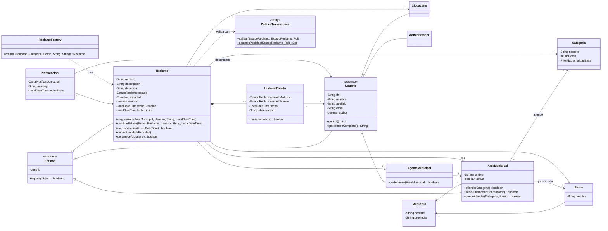
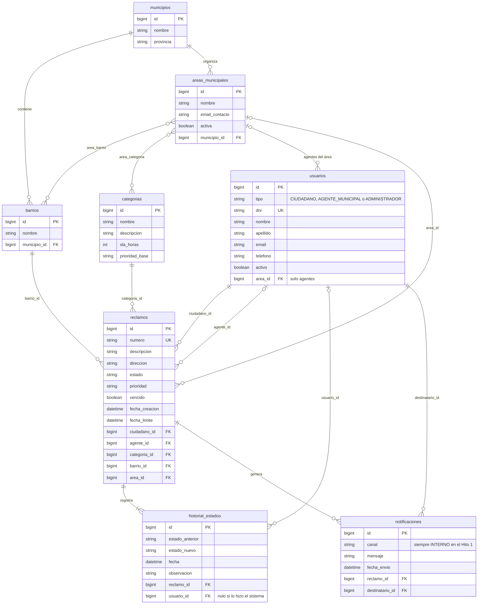

# Modelo de dominio

El dominio está en el módulo `reclamos-dominio`, paquete `ar.edu.uade.reclamos.dominio.modelo`. Son
clases Java sin anotaciones: el mapeo a tablas está aparte, en
`reclamos-persistencia/src/main/resources/META-INF/orm.xml`.

## Clases

`Reclamo` es la clase central: protege su estado, valida cada cambio contra `PoliticaTransiciones`
y registra su propio historial.

`Municipio`, `Barrio`, `Categoria`, `HistorialEstado` y `Notificacion` también heredan de `Entidad`;
no se dibuja para no cargar el diagrama.

| Enum | Valores |
| --- | --- |
| `EstadoReclamo` | `INGRESADO`, `ASIGNADO`, `EN_PROCESO`, `RESUELTO`, `CERRADO`, `RECHAZADO`, `CANCELADO` |
| `Prioridad` | `BAJA`, `MEDIA`, `ALTA`, `CRITICA` |
| `Rol` | `CIUDADANO`, `AGENTE_MUNICIPAL`, `ADMINISTRADOR`, `SISTEMA` |
| `CanalNotificacion` | `EMAIL`, `SMS`, `INTERNO` |

`Rol.SISTEMA` no corresponde a ningún usuario: representa las acciones automáticas, como la
asignación al crear el reclamo. En el Hito 1 todos los avisos usan el canal `INTERNO`.

## Reglas que viven en el dominio

| Regla | Dónde está |
| --- | --- |
| Qué transiciones de estado existen y qué rol puede ejecutar cada una | `PoliticaTransiciones` |
| Un ciudadano solo opera sobre sus reclamos; un agente, sobre los de su área | `Reclamo.cambiarEstado` |
| Solo se asigna a un área activa y distinta de la actual | `Reclamo.asignarArea` |
| Un área puede atender si está activa, atiende la categoría y cubre el barrio | `AreaMunicipal.puedeAtender` |
| Un reclamo vence una sola vez y sube un nivel de prioridad | `Reclamo.marcarVencido` |
| Todo reclamo nace `INGRESADO`, con número, fecha límite e historial | `ReclamoFactory.crear` |

El ciclo de vida completo está en [secuencias.md](secuencias.md#ciclo-de-vida-del-reclamo).

## Tablas

Tablas y columnas tal como las define `orm.xml`. Los tres tipos de usuario comparten la tabla
`usuarios` y se distinguen por la columna `tipo`. Las relaciones muchos a muchos usan las tablas
`area_barrio` y `area_categoria`.

