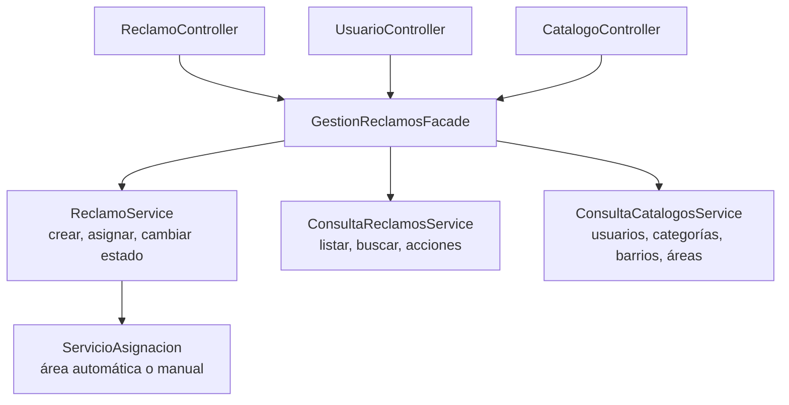

# Patrones de diseño aplicados

Los cinco patrones que pide la Primera Parte, con el problema que resuelve cada uno en este sistema,
las clases que lo implementan y cómo comprobarlo.

Las rutas son relativas a `backend/`. `…` abrevia `src/main/java/ar/edu/uade/reclamos`.

| Patrón | Para qué se usa | Clases principales |
| --- | --- | --- |
| Factory | Crear reclamos siempre consistentes | `ReclamoFactory` |
| Repository | Separar el negocio de la base de datos | 7 interfaces en el dominio, 7 adaptadores JPA |
| Strategy | Cambiar por configuración cómo se calcula la prioridad y cómo se asigna el área | `EstrategiaPrioridad`, `EstrategiaAsignacion` y sus 4 implementaciones |
| Observer | Reaccionar a lo que pasa con un reclamo sin acoplar componentes | `PublicadorEventos`, `NotificacionesReclamoListener`, `AuditoriaListener` |
| Facade | Dar a los controladores una única entrada a los casos de uso | `GestionReclamosFacade` |

## Factory

**Problema.** Un reclamo válido necesita número, estado inicial, fechas, prioridad y un primer
registro de historial. Si cada lugar que crea reclamos armara eso por su cuenta, tarde o temprano
alguno quedaría incompleto.

**Solución.** `ReclamoFactory` es el único lugar donde nace un reclamo.

| Qué garantiza | Cómo |
| --- | --- |
| Número único | `REC-` más ocho caracteres hexadecimales |
| Estado inicial | Siempre `INGRESADO` |
| Fecha límite | Fecha de creación más las horas de SLA de la categoría |
| Prioridad inicial | La prioridad base de la categoría |
| Historial | Primer registro: ingreso, a nombre del ciudadano |
| Validaciones | Rechaza datos faltantes y ciudadanos inactivos |

```java
public Reclamo crear(Ciudadano ciudadano, Categoria categoria, Barrio barrio,
                     String descripcion, String direccion) {
    // ...validaciones...
    LocalDateTime ahora = LocalDateTime.now(reloj).truncatedTo(ChronoUnit.SECONDS);
    LocalDateTime fechaLimite = ahora.plusHours(categoria.getSlaHoras());
    return new Reclamo(generarNumero(), ciudadano, categoria, barrio, descripcion, direccion,
            categoria.getPrioridadBase(), ahora, fechaLimite);
}
```

Recibe un `Clock`, de modo que los tests fijan la fecha y comprueban el cálculo del SLA.

- **Código:** `reclamos-dominio/…/dominio/fabrica/ReclamoFactory.java`
- **Quién la usa:** `ReclamoService.crear`
- **Tests:** `ReclamoFactoryTest`

## Repository

**Problema.** Si los servicios usaran JPA directamente, el negocio quedaría atado a la base de
datos y no se podría probar sin ella.

**Solución.** El dominio define **qué** necesita (interfaces) y la persistencia decide **cómo**
(adaptadores). Hay tres piezas por entidad:

```text
ReclamoRepository          interfaz del dominio; es lo único que ven los servicios
        ▲ implementa
ReclamoRepositoryJpa       adaptador en reclamos-persistencia
        │ delega
ReclamoJpaRepository       interfaz Spring Data JPA
```

```java
public interface ReclamoRepository {
    Reclamo guardar(Reclamo reclamo);
    Optional<Reclamo> buscarPorNumero(String numero);
    List<Reclamo> buscarPorCiudadano(Long ciudadanoId);
    List<Reclamo> buscarPorArea(Long areaId);
    long contarPendientesPorArea(Long areaId);
    // ...
}
```

Las siete interfaces son `ReclamoRepository`, `UsuarioRepository`, `MunicipioRepository`,
`BarrioRepository`, `AreaMunicipalRepository`, `CategoriaRepository` y `NotificacionRepository`.
El mapeo objeto-relacional está en `META-INF/orm.xml`, así que las clases del dominio no tienen
anotaciones de JPA.

- **Código:** `reclamos-dominio/…/dominio/repositorio/` y `reclamos-persistencia/…/persistencia/`
- **Quién lo usa:** todos los servicios y `AsignacionPorCargaDeTrabajo`
- **Tests:** `ReclamoRepositoryJpaTest`, `AreaMunicipalRepositoryJpaTest` y el resto de
  `reclamos-persistencia`, contra H2

## Strategy

**Problema.** Hay más de una forma razonable de calcular la prioridad y de elegir el área, y en el
Hito 2 se suman otras (IA, servicio SOAP). Con condicionales dentro del servicio, cada variante
nueva obligaría a modificarlo.

**Solución.** Dos familias de algoritmos intercambiables, cada una detrás de una interfaz.

| Interfaz | Implementación | Algoritmo | Valor de configuración |
| --- | --- | --- | --- |
| `EstrategiaPrioridad` | `PrioridadPorCategoria` | Devuelve la prioridad base de la categoría | `categoria` |
| `EstrategiaPrioridad` | `PrioridadPorPalabrasClave` | Si la descripción dice urgente, peligro, riesgo o accidente, sube como mínimo a `ALTA` | `palabras-clave` |
| `EstrategiaAsignacion` | `AsignacionPorJurisdiccion` | Entre las áreas candidatas, la de menor id | `jurisdiccion` |
| `EstrategiaAsignacion` | `AsignacionPorCargaDeTrabajo` | Entre las áreas candidatas, la que tiene menos reclamos pendientes | `carga-trabajo` |

Las áreas candidatas son las activas que atienden la categoría y tienen jurisdicción sobre el barrio.

La estrategia activa se elige en `application.yml`, sin tocar código:

```yaml
reclamos:
  prioridad:
    estrategia: categoria        # categoria | palabras-clave
  asignacion:
    estrategia: jurisdiccion     # jurisdiccion | carga-trabajo
```

`ConfiguracionAplicacion` lee esas propiedades y registra una implementación por interfaz.
Los servicios solo conocen las interfaces:

```java
// ReclamoService.crear
Reclamo reclamo = factory.crear(ciudadano, categoria, barrio, descripcion, direccion);
reclamo.definirPrioridad(prioridad.calcular(reclamo));
asignacion.asignarAutomaticamente(reclamo, categoriaId, barrioId, ahora());

// ServicioAsignacion.asignarAutomaticamente
Optional<AreaMunicipal> elegida =
        estrategia.seleccionarArea(reclamo, areas.buscarCandidatas(categoriaId, barrioId));
elegida.ifPresent(area -> reclamo.asignarArea(area, null, OBSERVACION_AUTOMATICA, ahora));
```

- **Código:** contratos en `reclamos-dominio/…/dominio/estrategia/`, implementaciones en
  `reclamos-app/…/aplicacion/estrategia/`
- **Tests:** `PrioridadTest`, `AsignacionTest`, `ServicioAsignacionTest`, `ConfiguracionAplicacionTest`
- **Demostración:** con la semilla, "Bache en Bernal" tiene dos áreas candidatas. Con
  `jurisdiccion` va siempre a Obras Públicas; con `carga-trabajo` se reparte con Mantenimiento Vial.

## Observer

**Problema.** Cuando se crea, asigna o resuelve un reclamo hay que avisar al ciudadano. Si el
servicio llamara directamente a quien avisa, cada reacción nueva (auditoría, broker, estadísticas)
obligaría a modificarlo.

**Solución.** El servicio publica un evento de dominio y no sabe quién escucha. Hay dos
observadores independientes; agregar un tercero no toca ni a los servicios ni a los otros dos.

| Pieza | Rol en el patrón |
| --- | --- |
| `PublicadorEventos` (interfaz del dominio) | Sujeto: por donde se publica |
| `PublicadorEventosSpring` | Implementación con `ApplicationEventPublisher` |
| `ReclamoCreado`, `ReclamoAsignado`, `EstadoReclamoCambiado`, `ReclamoResuelto`, `ReclamoVencido` | Eventos de dominio |
| `NotificacionesReclamoListener` | Observador 1: genera los avisos, dentro de la transacción |
| `AuditoriaListener` | Observador 2: registra cada evento en el log, después del commit |

| Evento | Quién lo publica | Avisos que genera |
| --- | --- | --- |
| `ReclamoCreado` | `ReclamoService.crear` | Ciudadano |
| `ReclamoAsignado` | `ReclamoService.crear` y `asignar` | Ciudadano y agentes activos del área |
| `EstadoReclamoCambiado` | `ReclamoService.cambiarEstado` | Ciudadano; en reapertura y cierre, también el agente a cargo |
| `ReclamoResuelto` | `ReclamoService.cambiarEstado` | Ciudadano |
| `ReclamoVencido` | `ServicioVencimientos.marcarVencidos` | Ciudadano y agente a cargo, o agentes del área |

```java
// ReclamoService: publica y sigue
eventos.publicar(new ReclamoCreado(guardado.getNumero(), ciudadano.getId(), categoriaId, barrioId,
        guardado.getPrioridad(), guardado.getFechaCreacion()));

// Observador 1: delega en ServicioNotificaciones, que decide a quién avisar
@EventListener
public void creado(ReclamoCreado evento) {
    notificaciones.avisarIngreso(evento.numeroReclamo(), evento.ocurridoEn());
}

// Observador 2: audita cualquier evento, solo si la transacción se confirmó
@TransactionalEventListener(phase = TransactionPhase.AFTER_COMMIT, fallbackExecution = true)
public void registrar(EventoDominio evento) {
    LOGGER.info("{} reclamo={} fecha={} detalle={}", evento.nombre(), evento.numeroReclamo(),
            evento.ocurridoEn(), evento);
}
```

Los dos observadores corren en momentos distintos a propósito:

- **Los avisos** participan de la transacción del servicio: si fallan, se revierte todo el caso de uso.
- **La auditoría** corre después del commit: una operación revertida no queda auditada.

Los eventos llevan solo identificadores y datos simples, de modo que en el Hito 2 se pueden enviar
a un broker como JSON sin cambiarlos. Ese envío tiene que hacerse después del commit, igual que la
auditoría.

- **Código:** contratos en `reclamos-dominio/…/dominio/evento/`, implementación en
  `reclamos-app/…/aplicacion/evento/`
- **Tests:** `FlujoDeAvisosTest` (sin Spring), `ObserverIntegrationTest`, `ServicioNotificacionesTest`,
  `ServicioVencimientosTest`
- **Demostración:** el detalle de un reclamo en la interfaz muestra "Avisos enviados" y la
  pestaña "Avisos" reúne los que recibió cada usuario; también
  `GET /api/reclamos/{numero}/notificaciones` y `GET /api/notificaciones`. La auditoría se ve en el log del backend, en las
  líneas del logger `auditoria`.

## Facade

**Problema.** Crear un reclamo involucra permisos, catálogos, fábrica, estrategias, persistencia y
eventos. Los controladores no deberían conocer ni coordinar todo eso.

**Solución.** `GestionReclamosFacade` es la única clase de aplicación que ven los tres controladores.
Expone los casos de uso con nombres del negocio y delega en los servicios.



```java
@PostMapping
public ResponseEntity<ReclamoResponse> crear(@RequestHeader("X-Usuario-Id") @Positive Long usuarioId,
                                             @Valid @RequestBody CrearReclamoRequest request) {
    Reclamo reclamo = facade.crear(usuarioId, request.categoriaId(), request.barrioId(),
            request.descripcion(), request.direccion());
    return ResponseEntity.created(URI.create("/api/reclamos/" + reclamo.getNumero()))
            .body(respuesta(usuarioId, reclamo));
}
```

La fachada no depende de HTTP. En el Hito 2 la pueden reutilizar el servicio SOAP y los
consumidores de mensajes.

- **Código:** `reclamos-app/…/aplicacion/facade/GestionReclamosFacade.java`
- **Tests:** `GestionReclamosFacadeTest`, `RestIntegrationTest`
