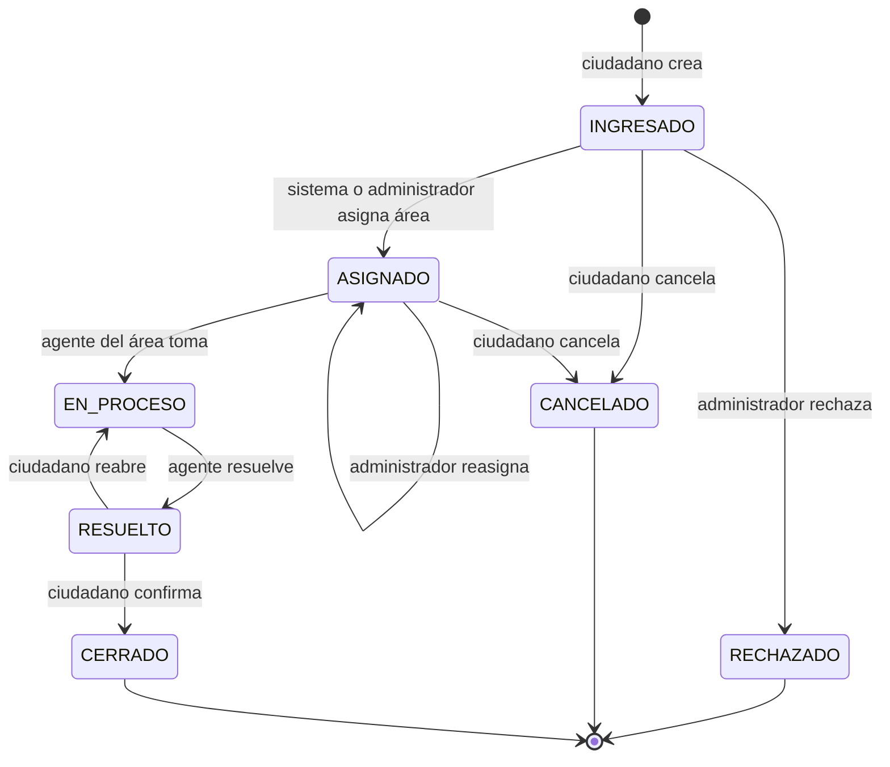
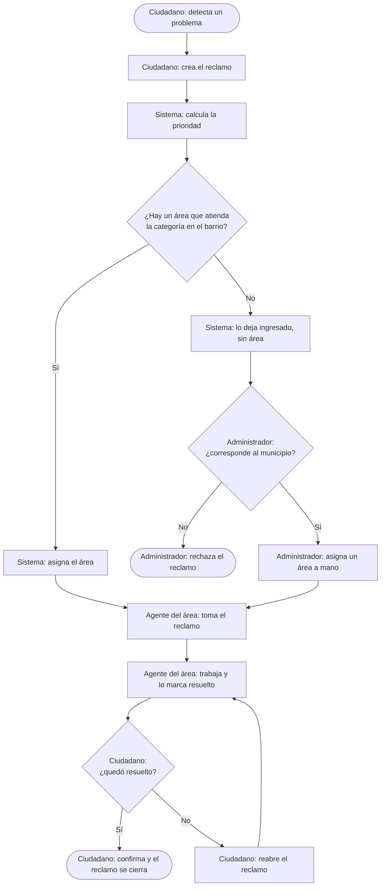
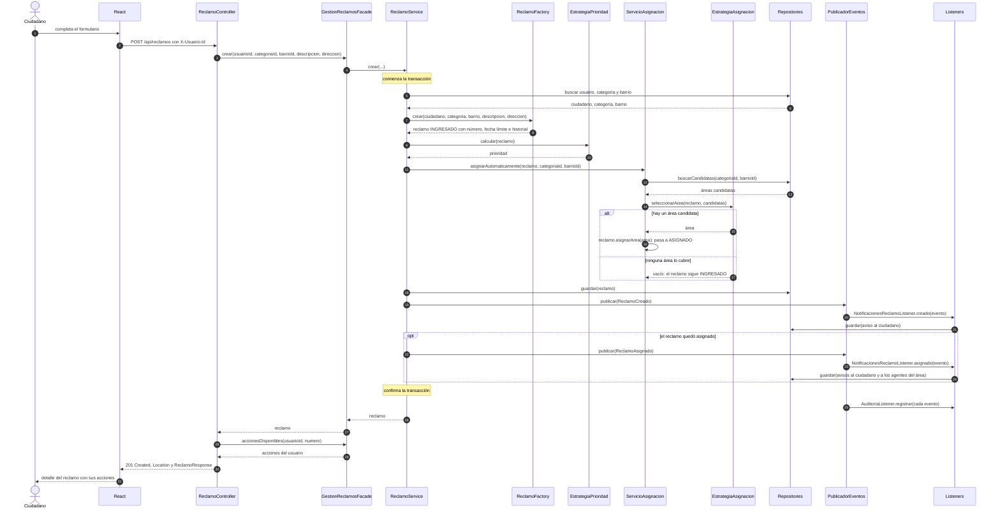
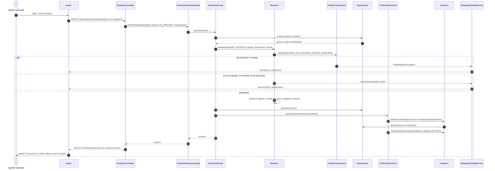
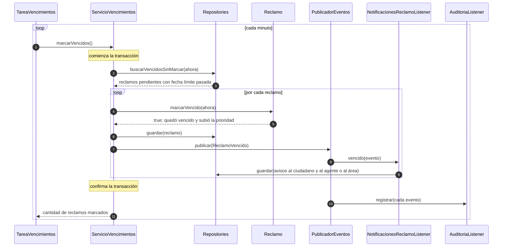

# Proceso de negocio y secuencias

## Ciclo de vida del reclamo

Las transiciones y los roles están definidos en un único lugar: `PoliticaTransiciones`.

Una transición que no está en el diagrama responde `409`. Una que está, pedida por un rol que no
corresponde o sobre un reclamo ajeno, responde `403`.

El vencimiento no es un estado. Un reclamo `INGRESADO`, `ASIGNADO` o `EN_PROCESO` que pasa su fecha
límite queda marcado como vencido y sube un nivel de prioridad, sin cambiar de estado.

## Proceso de negocio

Diagrama simplificado. Cada paso indica quién lo ejecuta.

El ciudadano recibe un aviso en cada paso. Puede cancelar el reclamo mientras nadie lo haya tomado.

## Secuencia: creación de un reclamo

Intervienen los cinco patrones: Facade (paso 3), Factory (7), Strategy (9 y 14), Repository (5, 12,
18) y Observer (19 a 25).

## Secuencia: cambio de estado

El ejemplo es un agente que toma un reclamo. Las demás transiciones recorren el mismo camino.

Cuando el destino es `RESUELTO`, el servicio publica además `ReclamoResuelto`, y el aviso al
ciudadano sale de ese evento.

La asignación manual usa `PATCH /api/reclamos/{numero}/asignacion`: recorre el mismo camino, llama a
`Reclamo.asignarArea` y publica `ReclamoAsignado`.

## Secuencia: vencimiento de un reclamo

Es el único proceso que no arranca con una acción de un usuario: lo dispara una tarea programada.

Cada reclamo se marca una sola vez: en la siguiente ejecución ya no aparece entre los vencidos sin
marcar, así que no se repiten eventos ni avisos.
